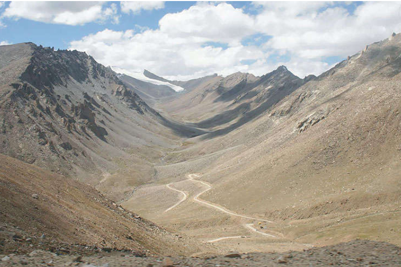

## Landform
The Himalayan range is the result of the collision between the Indian and Asian Plate. The timing of the collision is still object of debate ([Hu et al., 2016](htps://doi.org/10.1016/j.earscirev.2016.07.014), [Khan et al., 2009;]( htps://doi.org/10.1130/B26348.1) [Rehman et al., 2011](htps://doi.org/10.1111/j.1440-1738.2011.00774.x)) with estimates ranging from 100 to 40 Ma. Isostatic adjustment following the collision begun 20 Ma lifting the newly formed Himalayan batholith. The currents height was probably reached between 2.5 to 1.8 Ma ([Powell and Conaghan, 1973](https://www.sciencedirect.com/science/article/abs/pii/0012821X73901349)). The isostatic movement created three main thrust lines visible in Figure 3. A geological map is shown in Figure 6. For a more detailed one refer to [Phillips (2008)](htps://doi.org/10.4113/jom.2008.98). The region is still geologically active and has experienced earthquake as in 2008 and 2015.

The landform of Ladakh is predominantly dominated by glacial processes causing the “U” shaped valley (Figure 4) typical of the region reaching a width of 4
km near Nyoma. Fluvial activity created additional features as gorges, strath terraces, glacial outwash plains. More recently (25-17 ka) eaolian activity contributed
by creating dunes and sand ramps as seen in Figure 5 ([Juyal, 2014;](htps://doi.org/10.1007/978-94-017-8029-2_10) [Kumar and Srivastava, 2018](htps://doi.org/10.1007/978-94-017-8029-2_10)).

